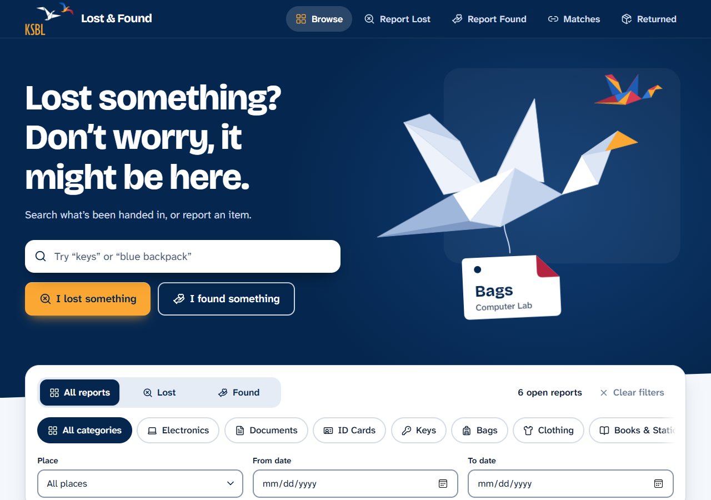
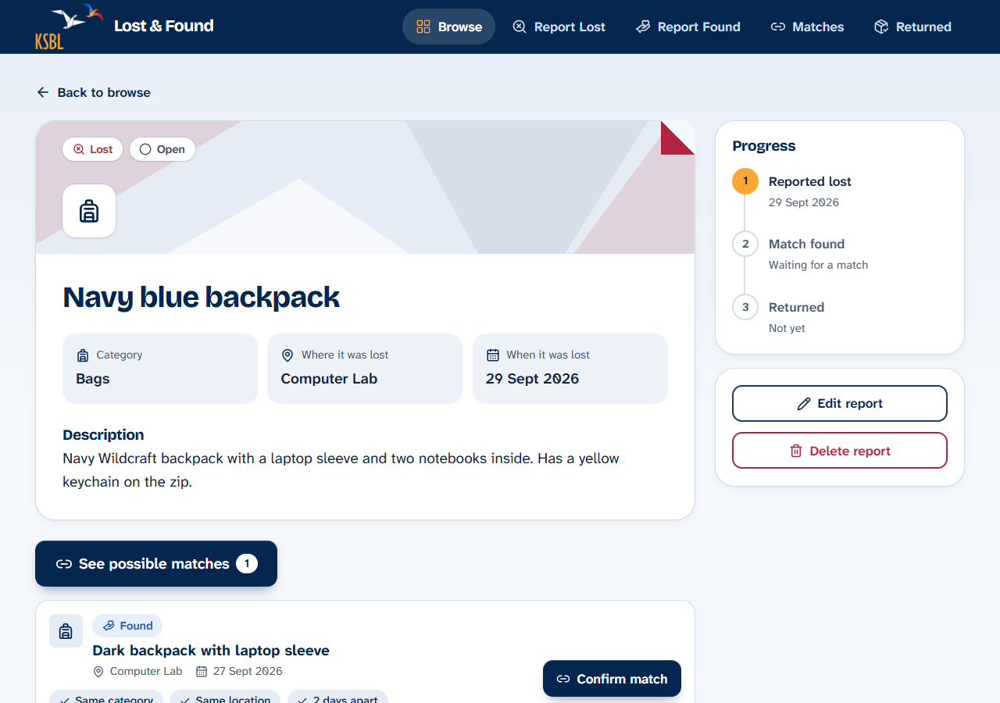
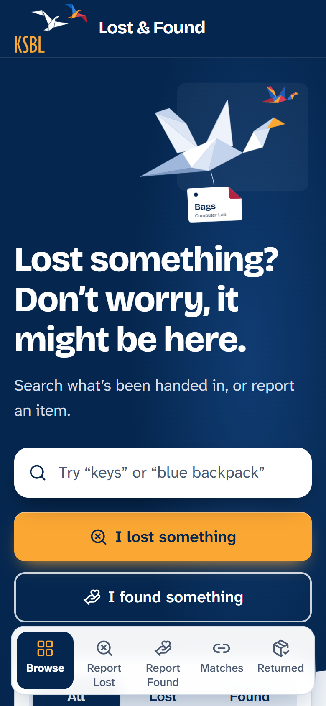

# KSBL Lost & Found

A web app where students, faculty and staff report items they have **lost** or **found** on campus, browse and search reports, and discover **possible matches** between lost and found items.

| Layer | Technology |
|---|---|
| Frontend | React (Vite), Tailwind CSS v4, lucide-react icons, React Router |
| Backend | Node.js + Express, REST API (JSON) |
| Database | SQLite through the libSQL client (`@libsql/client`): a local file `server/lostfound.db` by default, or a hosted Turso database (also SQLite) when deployed |
| Auth | None (as specified) |

<p align="center">
  
</p>

<p align="center">
  
  &nbsp;
  
</p>

---

## 1. Setup

You need **Node.js 18 or newer** (developed on Node 22). No Docker and no database server.

```bash
# 1. Install everything (root, server and client) in one go
npm run setup

# 2. Create the database and fill it with 14 sample campus items
npm run seed

# 3. Start the API (http://localhost:3001) and the website (http://localhost:5173) together
npm run dev
```

Open **http://localhost:5173**.

The database table is created automatically the first time the server starts, so step 2 is optional (without it the app simply starts empty). `npm run seed` **clears the items table first**, so only use it on demo data.

### Other commands

| Command | What it does |
|---|---|
| `npm test` | Runs all server tests: the 5 matching examples (`server/matching.test.js`) and the API tests (`server/api.test.js`) |
| `npm run build` then `npm start` | Builds the React app and serves it **and** the API from one server at http://localhost:3001 |
| `npm run seed` | Resets the database to the sample data |

To start from scratch, stop the server and delete `server/lostfound.db*`.

### Troubleshooting

* **Port already in use**: set another port (PowerShell: `$env:PORT=4000; npm start --prefix server`, bash: `PORT=4000 npm start --prefix server`) and update the proxy target in `client/vite.config.js`.
* **Install problems on Windows**: the database driver ships prebuilt binaries, so no compiler is needed. If an install fails with a "path too long" error, move the project to a shorter folder such as `C:\dev\ksbl-lost-and-found` (Windows limits paths to 260 characters).

---

## 2. Project structure

```
client/                  React app
  src/pages/             Browse, Report, Item details, Edit, Matches
  src/components/        Layout (nav), ItemCard, ItemForm, MatchResults, ConfirmDialog, Toast, ui
  src/index.css          Design tokens (all colours live here)
  src/constants.js       Category / location lists and icons
server/
  index.js               Starts the server
  app.js                 Every REST route, with comments
  matching.js            THE matching rule (the only place matching logic lives)
  matching.test.js       The 5 worked examples + extra checks
  api.test.js            End-to-end API tests (temporary database file)
  validation.js          Server-side validation
  db.js                  SQLite connection (local file or Turso) + automatic table creation
  seed.js                Sample data
```

---

## 3. Data model

Table `items`

| Field | Type | Rules |
|---|---|---|
| id | INTEGER | Primary key, auto-increment |
| type | TEXT | `Lost` or `Found` |
| title | TEXT | 3–100 characters |
| description | TEXT | 1–500 characters |
| category | TEXT | Electronics, Documents, ID Cards, Keys, Bags, Clothing, Books & Stationery, Wallets & Money, Accessories, Other |
| location | TEXT | One of the 23 KSBL places below (fixed list, grouped in the dropdown) |
| date | TEXT | `YYYY-MM-DD`, a real calendar date, not in the future |
| status | TEXT | `Open` (default), `Matched`, `Returned` |
| matched_with | INTEGER | *Added column.* Id of the partner item once a pair is confirmed; otherwise `NULL` |

The category and location dropdowns are fixed lists (no free text), so matching is reliable. Values are validated in the browser, again in the API, and finally by `CHECK` constraints in the database.

> **Why `matched_with`?** The assignment says a pair can be marked *Matched* and later *Returned*. Without storing which two items belong together, "Returned" could not update both. It is the only column beyond the specified table.

---

## 4. REST API

Base URL: `http://localhost:3001/api`. Errors are JSON, e.g. `{ "error": "Title is required" }`; validation errors also include `"errors": { "title": "…" }` so forms can show each message next to its field.

| Method | Path | Description | Success |
|---|---|---|---|
| GET | `/health` | *Extra.* Is the API up, and is it using the `local` file or the `hosted` database? | 200 |
| GET | `/items` | List items (newest date first). Filters: `type`, `category`, `location`, `status`, `search` (title or description, case-insensitive), `dateFrom`, `dateTo` (inclusive). Filters combine with AND. | 200 |
| GET | `/items/:id` | One item | 200 / 404 |
| POST | `/items` | Create an item (all fields validated; `status` defaults to `Open`) | 201 / 400 |
| PUT | `/items/:id` | Update an item (all fields validated) | 200 / 400 / 404 |
| DELETE | `/items/:id` | Delete an item | 200 / 404 |
| GET | `/items/:id/matches` | Possible Found items for a **Lost** item, closest date first, with the reasons. A Found item returns **400**. | 200 / 400 / 404 |
| GET | `/matches` | *Extra.* Overview for the Matches page: every Lost item with possible matches or a confirmed partner | 200 |
| POST | `/items/:id/confirm-match` | *Extra.* Body `{ "foundId": 7 }`. Pairs a Lost item with a Found item (both must be `Open` and really match). Both become `Matched`. | 200 / 400 / 404 / 409 |
| POST | `/items/:id/mark-returned` | *Extra.* Only for `Matched` items. The item and its partner become `Returned`. | 200 / 404 / 409 |

Status codes used: 200, 201, 400 (invalid input), 404 (not found), 409 (conflict, e.g. already matched), 500 (unexpected server error). All SQL uses parameterized prepared statements; user input never becomes part of the SQL text.

Breaking a pair (editing a matched item back to `Open`, changing its category/location/date, or deleting it) automatically releases the partner back to `Open`.

Example `GET /api/items/3/matches`:

```json
{
  "item": { "id": 3, "type": "Lost", "title": "Navy blue backpack", "...": "..." },
  "rules": { "maxDaysApart": 2, "requireSameCategory": true, "requireSameLocation": true,
             "minCommonKeywords": 1, "keywordFields": ["description"], "excludeStatuses": ["Returned"] },
  "matches": [
    { "item": { "id": 11, "type": "Found", "...": "..." }, "daysApart": 2,
      "conditions": { "sameCategory": true, "sameLocation": true },
      "sharedKeywords": ["backpack", "notebooks"],
      "reasons": ["Same category", "Same location", "2 days apart", "Shared words: backpack, notebooks"] }
  ]
}
```

---

## 5. The matching rule (for the assignment report)

Matching is implemented **on the server**, in one file: `server/matching.js`.

> **Current rule: same category + same location + at most 2 days apart + at least 1 common description keyword.**
> (Change history: the original rule allowed 3 days and did not look at descriptions.)

A Lost item **L** matches a Found item **F** if and only if **all** of these are true:

1. `L.type = "Lost"` and `F.type = "Found"`
2. `F.category = L.category`
3. `F.location = L.location`
4. `|F.date − L.date| ≤ 2` days (inclusive)
5. the two **descriptions share at least 1 keyword**

Items whose status is `Returned` are excluded. Results are sorted with the **smallest date difference first**.

**How the date difference is computed.** Dates are `YYYY-MM-DD` text. Each is converted to midnight UTC (`Date.UTC(y, m-1, d)`), the two values are subtracted, the absolute value is taken and divided by the number of milliseconds in a day. Because both dates are at midnight UTC, time of day and daylight-saving changes cannot change the answer: it is a pure calendar-day difference. Using the absolute value means a Found item reported *before* the Lost date still matches (e.g. found 2 days earlier).

**How keywords are found.** Each description is turned into a set of keywords, and the reports share a keyword when the same word appears in both:

1. lower-case the text and split it into words (letters and digits only);
2. drop very short words (under 3 characters) and common filler words (`the`, `with`, `near`, and words that appear in almost every report such as `lost`, `found`, `left`);
3. reduce simple plurals to one form, so `keys` matches `key`, `notebooks` matches `notebook`, and `glasses` matches `glass`.

Only the description is searched (a shared word in the title does not count). Every match lists the words that were shared, e.g. *"Shared words: backpack, notebooks"*, so a person can see why two reports were paired. This also means the wording of a description matters: the report form tells people to mention colour, brand and marks. The filler-word list and the plural rule are at the top of `server/matching.js` and can be adjusted.

**Worked examples** (all automated in `server/matching.test.js`; the Lost item is *Keys, Library, 2026-03-10*, and each Found item's description shares the word "keys"):

| Found item | Result | Reason |
|---|---|---|
| Keys, Library, 2026-03-13 | No match | 3 days apart (was a match under the old 3-day rule) |
| Keys, Library, 2026-03-14 | No match | 4 days apart |
| Keys, Cafeteria, 2026-03-10 | No match | different location |
| Bags, Library, 2026-03-10 | No match | different category |
| Keys, Library, 2026-03-08 | **Match** | 2 days apart; found *before* the lost date is allowed |
| Keys, Library, 2026-03-12 | **Match** | exactly 2 days apart (the limit is inclusive) |
| Keys, Library, 2026-03-10, description "Black leather wallet" | No match | everything fits but no shared description keyword |

**Why this design.** The rule's numbers and switches live in one config object (`MATCH_RULES`). The API, the match counts on the pages and the explanatory text all read from it, and the API sends the active rules with every match response, so changing the rule changes the behaviour everywhere without touching another file. Each match carries a `reasons` list ("Same category · Same location · 2 days apart · Shared words: backpack") which the interface shows as chips. The server also enforces the rule when a match is confirmed, so a pair that does not satisfy it can never be linked.

### How to modify the matching rule

All steps use only `server/matching.js` and `server/matching.test.js`.

1. **Open `server/matching.js`** and find the config at the top:

   ```js
   const MATCH_RULES = {
     maxDaysApart: 2,
     requireSameCategory: true,
     requireSameLocation: true,
     minCommonKeywords: 1,
     keywordFields: ["description"],
     excludeStatuses: ["Returned"],
   };
   ```

2. **Change the values you want.** For example:
   * Allow up to a week: `maxDaysApart: 7`
   * Ignore the place: `requireSameLocation: false`
   * Require two shared words: `minCommonKeywords: 2` (or `0` to ignore descriptions)
   * Also compare titles: `keywordFields: ["title", "description"]`
   * Also hide matched items from suggestions: `excludeStatuses: ["Returned", "Matched"]`

3. **Re-run the tests:** `npm test` (from the project root or the `server` folder). Any of the 5 examples whose outcome changed now **fails**. For instance, with `maxDaysApart: 5`, "Example 2: 4 days apart" fails because 4 days is now a match. (This is exactly what happened when the limit went from 3 to 2 days: "Example 1" flipped from match to no match.)

4. **Update the expected results.** In `server/matching.test.js`, edit the `expected` value (and the example's `name`) of each failing example in the `EXAMPLES` list so it describes your new rule. Run `npm test` again until everything passes. (The other tests read `MATCH_RULES`, so they keep working.)

5. **Restart the server** (`npm run dev` restarts automatically when `server/` files change). Reload the app: the Matches page and the "No matches yet" message show the new rule in words (e.g. "within 5 days of the date"), and the reason chips reflect it. The wording is built from the rule by `describeRules()` in `client/src/components/MatchResults.jsx`; if you add a new kind of condition, add a clause there too if you want it explained in words.

6. **If you add a brand-new condition** (for example "same first word in the title"):
   * add a key to `MATCH_RULES`,
   * add the check inside `evaluateMatch()` in `matching.js`,
   * push a matching entry into `reasons` (so it is displayed),
   * add examples to `matching.test.js`.

   No other file needs to change.

---

## 6. Design

The concept is **folded paper**, taken from the origami bird in the KSBL logo. Navy leads, amber is the single accent, everything else is quiet and white with soft navy-tinted depth.

* **Hero:** short, reassuring copy ("Lost something? Don't worry, it might be here.") beside an illustration (`HeroArt.jsx`): the origami bird, redrawn as flat triangles, carries a swinging paper luggage tag that shows a real recent report. The facets assemble once on load; a small multicolour bird (the logo's second bird) flies behind. The hero's bottom edge is cut on a diagonal like a fold.
* **Report cards:** each card has an illustrated header of pale paper-fold triangles tinted crimson (Lost) or blue (Found), the category icon, and a folded top-right corner that opens a little on hover.
* **Item page:** a three-step progress timeline (Reported, Matched, Returned) in a sticky side panel.
* **Browse:** a Lost / Found switch and category chips with icons instead of dropdowns; the remaining filters (place, status, dates) sit below them.
* **Phones:** a floating bottom navigation bar with a clear active pill.

### Final colour palette

All colours are CSS variables / Tailwind theme tokens in `client/src/index.css` (nothing hard-coded in components). Ratios are WCAG contrast for the pairing shown.

| Token | Hex | Used for | Contrast |
|---|---|---|---|
| `navy` | `#05274F` | Header, hero, primary buttons, headings | 14.9:1 with white |
| `navy-hover` | `#0E3A6C` | Hover state of navy buttons | |
| `navy-soft` | `#E6ECF5` | Icon tiles, reason chips, hover fills | |
| `amber` | `#FBA733` | The one accent: main call-to-action buttons, active-nav underline, focus ring on navy. **Never used as text on white** (only 2.1:1) | navy on amber 7.6:1 |
| `canvas` | `#F5F7FA` | Page background | |
| `surface` | `#FFFFFF` | Cards and fields | |
| `ink` | `#14233A` | Body text | 14.7:1 on canvas |
| `muted` | `#4B5A70` | Secondary text | 6.5:1 on canvas |
| `line` / `field` | `#C9D2DF` / `#8895A8` | Card borders / form-control borders (3:1) | |
| `lost` + tint | `#B42340` on `#FCE9EC` | Lost tag, errors, delete | 5.5:1 |
| `found` + tint | `#1D5BB5` on `#E6F0FC` | Found tag | 5.7:1 |
| Open pill | `#34445C` on `#E8ECF2` | Status: Open (slate) | 8.3:1 |
| Matched pill | `#7A4A00` on `#FDF0D5` | Status: Matched (soft amber) | 6.6:1 |
| Returned pill | `#1B6540` on `#E2F3E9` | Status: Returned (muted green) | 6.1:1 |

The logo's crimson (`#D83C54`) and blue (`#3078D8`) are only 4.5:1 and 4.4:1 on white, so the text versions above are darkened versions of the same hues. Lost and Found are never told apart by colour alone: each tag has its own icon (search-x / hand) and the word itself.

### Campus places

The place dropdown (report form and filters) is grouped; the same 23 fixed values are validated by the server and the database:

| Group | Places |
|---|---|
| Entrance & outdoors | Reception, Garden, Parking, Courtyard |
| Study & labs | Library, Computer Lab, Hardware Lab, Lecture Hall 1 / 2 / 3, Seminar Hall 1 / 2 / 3 |
| Campus life | Cafeteria, Campus Activity Center (CAC), Gym |
| Prayer rooms & washrooms | Prayer Room (Male), Prayer Room (Female), Washroom 1 (Male), Washroom 2 (Male), Washroom 1 (Female), Washroom 2 (Female) |
| (ungrouped) | Other |

To add or rename a place, edit `server/constants.js` **and** `client/src/constants.js` (keep them identical). A database created with an older place list is upgraded automatically the first time the server starts: rows, ids and matched pairs are kept, and old places are translated (for example "Sports Area" becomes "Gym", "Parking Area" becomes "Parking"); this is covered by `server/db.test.js`.

### Logo

`client/public/ksbl-logo.png` is the supplied logo (transparent background), trimmed to its artwork and shown directly on the navy header. The navy (`#05274F`) and amber (`#FBA733`) in the palette were sampled from the logo itself so it blends in without a box around it.

### Typography

Two families: **Bricolage Grotesque** for headings and the wordmark (a characterful display face), and **Atkinson Hyperlegible Next** for everything you read (designed by the Braille Institute so similar characters such as I / l / 1 and O / 0 are easy to tell apart). Body text is 17px.

### Accessibility and usability

* Five navigation items with icon + label (Browse, Report Lost, Report Found, Matches, Returned): top bar on desktop, floating bottom bar on phones. The current page is highlighted and exposed with `aria-current="page"`.
* All tap targets are at least 44px; every input has a visible label; errors appear next to the field in plain language and are linked with `aria-describedby`; focus moves to the first problem on submit.
* Visible keyboard focus everywhere (navy ring, amber on navy), a "skip to main content" link, semantic landmarks, native `<dialog>` for the delete / return confirmations (focus trap and Escape work out of the box).
* Motion is light and purposeful: the hero bird assembles once on load, cards lift and their fold opens on hover, buttons press slightly, dialogs and toasts ease in (under 200ms), and loading skeletons shimmer. Everything is switched off under `prefers-reduced-motion`.
* Checked with the axe-core accessibility engine (WCAG 2.0/2.1 A + AA and best practices) on the browse, report, item, matches and matched-item pages: 0 violations. No horizontal scrolling at 390px, 820px or 1280px widths.

---

## 7. Notes and assumptions

* "Not in the future" is checked against the server's local date; the browser's date picker is also capped at today.
* A `Matched` Found item can still be *suggested* for another Lost item (only `Returned` is excluded by default, as specified); it is labelled "Already matched" and cannot be confirmed twice.
* The Found item page lists the Lost reports that could be its owner ("Someone may be looking for this").
* **Where each report lives (by status):** *Browse* lists only **Open** reports, so it never mixes with items that are already sorted out. When a pair is confirmed it moves to *Matches* (under "Ready to hand back"), and when it is marked returned it moves to the *Returned* tab. A report page highlights the tab its report belongs to, and its "Back" link goes there.
* The `Matches` tab shows ready-to-hand-back pairs first, then lost reports with possible matches. The `Returned` tab shows each returned pair side by side.

---

## 8. Deploying to Vercel (with a hosted database)

The repository is set up as a **Vercel project with two services** (`vercel.json`):

| Service | Folder | Public path | Notes |
|---|---|---|---|
| `client` | `client/` | `/` (everything not under `/api`) | Vite build; falls back to `index.html` so links like `/items/3` work |
| `server` | `server/` | `/api/*` | The Express API (`server/index.js`). Requests keep their full path, so the routes are unchanged |

There are **no service-to-service calls**, so no bindings are needed: the browser calls `/api/...` on the same domain, and Vercel routes it to the server.

**Why a hosted database.** Vercel functions have a read-only filesystem and no storage that is shared between requests, so a `lostfound.db` file cannot work there ([Vercel says SQLite can't be used on its platform](https://vercel.com/guides/is-sqlite-supported-in-vercel)). The app therefore talks to the database through the libSQL client, which opens **either** a local file (development, tests) **or** a hosted [Turso](https://turso.tech) database, which is SQLite in the cloud. The SQL is identical in both cases. The database is chosen by environment variables:

| Variable | Meaning |
|---|---|
| `TURSO_DATABASE_URL` | e.g. `libsql://ksbl-lost-found-yourname.turso.io`. If unset, the local file `server/lostfound.db` is used |
| `TURSO_AUTH_TOKEN` | the token for that database |

(See `server/.env.example`. Never commit real values; `.env` files are git-ignored.)

### Steps

1. **Push the project to GitHub** (see the publishing steps in the project notes).
2. **Create the database.** Sign up at turso.com, create a database (e.g. `ksbl-lost-found`), then copy its **URL** and create a **token** (dashboard, or `turso db show ksbl-lost-found --url` and `turso db tokens create ksbl-lost-found`).
3. **Create the Vercel project.** On vercel.com choose **Add New, Project**, import the GitHub repo, and accept the detected **services** (`client`, `server`). Keep the repo root as the root directory.
4. **Add the environment variables** `TURSO_DATABASE_URL` and `TURSO_AUTH_TOKEN` in **Settings, Environment Variables**, for Production (and Preview if you want previews to work), then deploy.
5. **Add sample data once** (optional). From your computer, with the same two variables set, run the seed script. It **clears the items table first**, so only do this on a fresh database:

   PowerShell:
   ```powershell
   $env:TURSO_DATABASE_URL="libsql://..."; $env:TURSO_AUTH_TOKEN="..."; npm run seed
   ```
   bash:
   ```bash
   TURSO_DATABASE_URL="libsql://..." TURSO_AUTH_TOKEN="..." npm run seed
   ```
6. **Check it.** Open `https://<your-project>.vercel.app/api/health`. You should see `{"ok":true,"database":"hosted","items":N}`. `"database":"local"` means the environment variables are missing; a 500 error means the URL or token is wrong (see the function logs in Vercel).

Each report you add on the live site is stored in Turso, so it is still there on the next visit and shared by every visitor.
